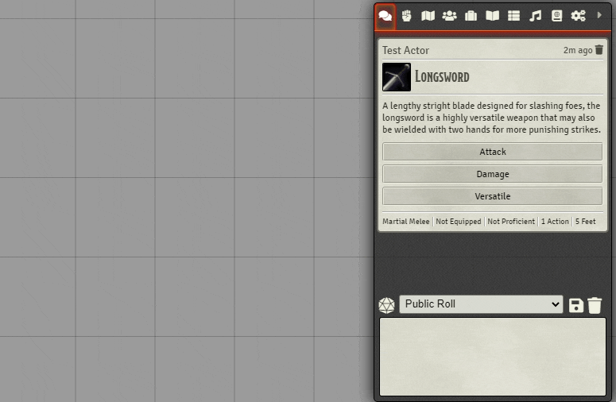

# DnD5e Perfect Critical Hits

A module to enable perfect critical hits on a user by user basis.

A typical critical hit within DnD5e means that twice as many dice are rolled when determining damage. So a fighter with 16 strength that crits with a longsword would deal `2d10 + 3` damage (or `2d12 + 3` damage if wielding the weapon with 2 hands). But many home games use a variant rule where the additional critical damage dice are taken to be their highest face value. For example, that same fighter critting with a longsword would deal `1d10 + 3 + 10` damage (or `1d12 + 3 + 12` versatile damage).

This module allows individual users the ability to enable/disable this functionality under the typical `Configure Settings` &rarr; `Module Settings` dialog, and is true by default. Users can also right-click on the `.chat-control-icon` (the d20 just above the chat message textarea) to more quickly toggle this functionality.

---

## Dependencies

- Foundry VTT Quick Module Context Menu Settings
  - manifest: https://raw.githubusercontent.com/Erebus-FoundryVTT-Modules/foundry-vtt-quick-module-context-menu-settings/main/module.json
  - url: https://github.com/Erebus-FoundryVTT-Modules/foundry-vtt-quick-module-context-menu-settings
